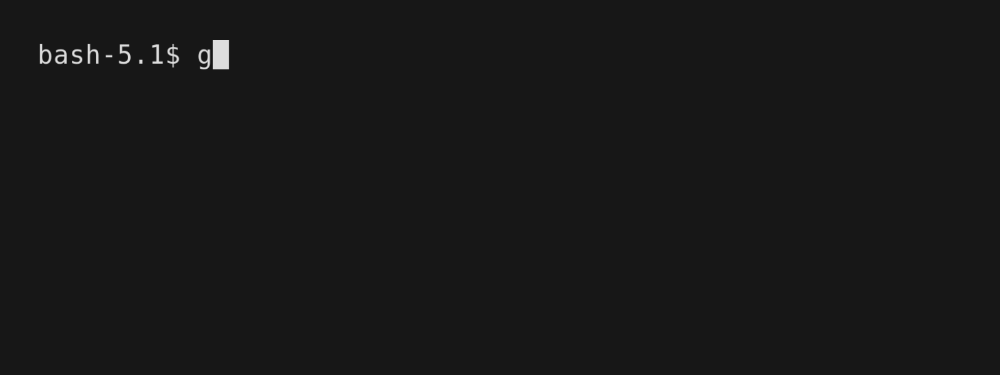

# grpclient
`grpclient` is gRPC command line client for testing grpc services



## Installation
> [!NOTE]
> `grpclient` requires [`grpcurl`](https://github.com/fullstorydev/grpcurl) to be installed and available on your `PATH`.

### From Source
```bash
# Clone the repository
git clone git@github.com:cpf2021-gif/grpclient.git

# install the binary
go install
```